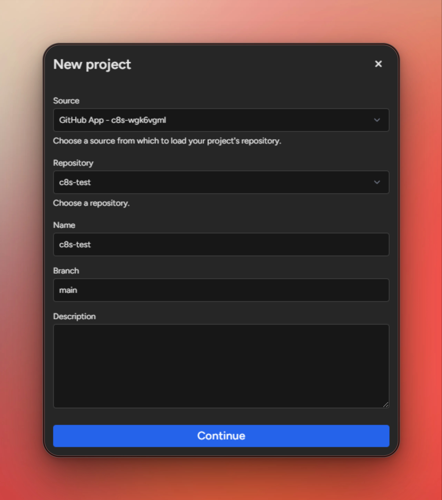
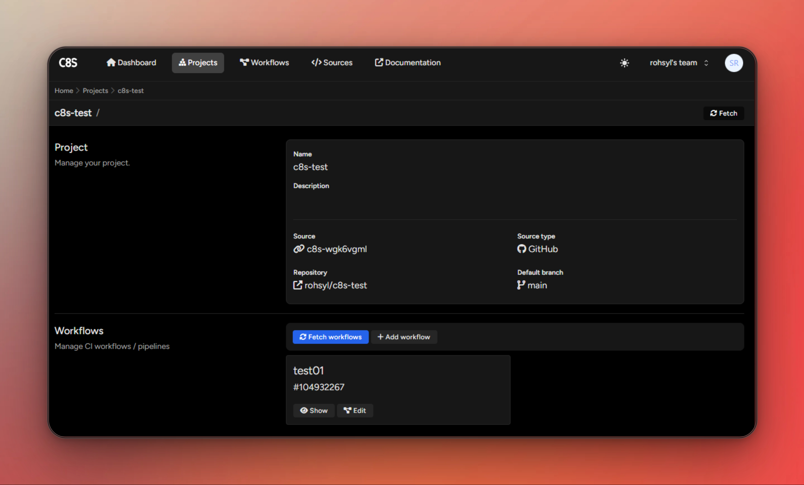

# GitHub Repository

Before linking a repository to c8s you need to have [source set up](Create-a-new-source.md) and configured correctly.

## Link a GitHub Repository

- Go to <ui-path>Projects</ui-path> and click on <control>+ Add</control>.
- Select the source created earlier.
- Select an existing repository.

> <tip>If you don't see it in the list, maybe the source you configured don't have any access to it.</tip>

- You can set a name and a descriptions. Make sure the branch set is an existing branch on your repository.

- You're project is now linked to c8s, and you are ready to play with workflows !

