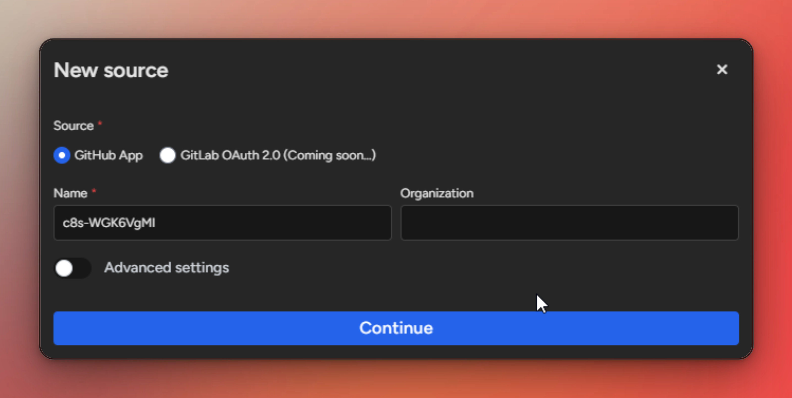
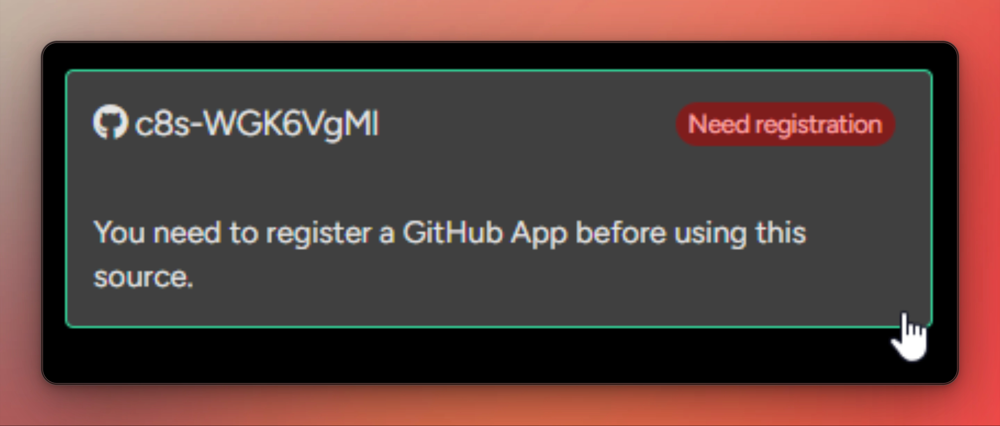
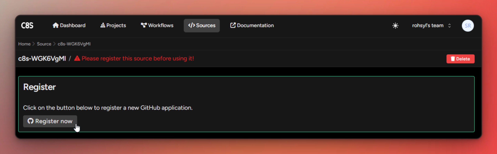
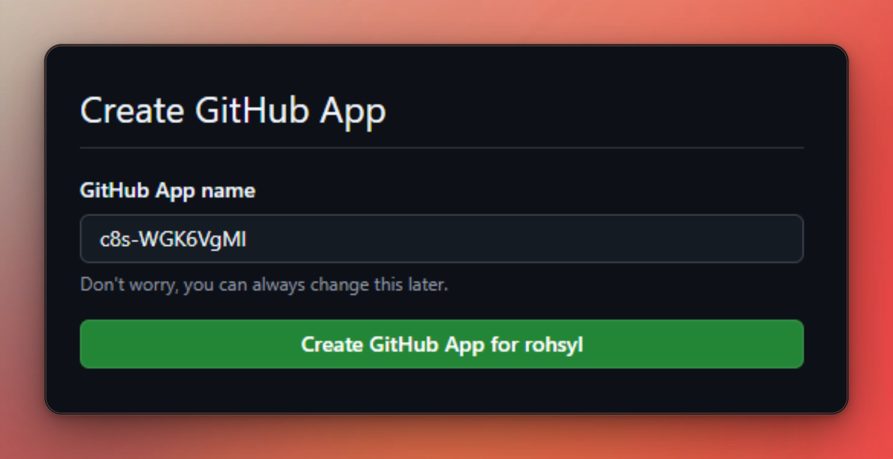
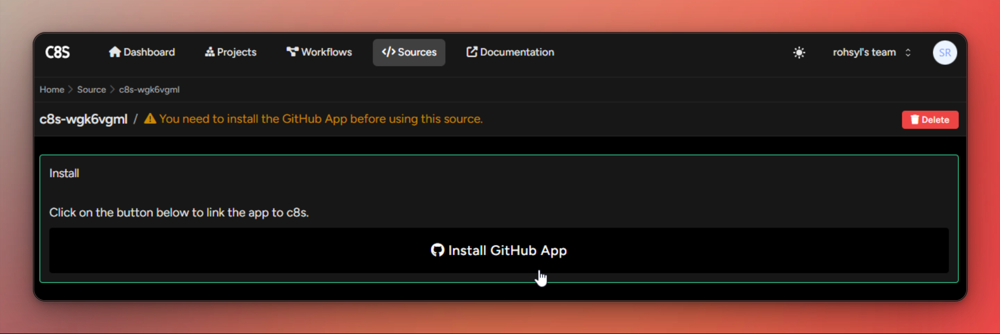
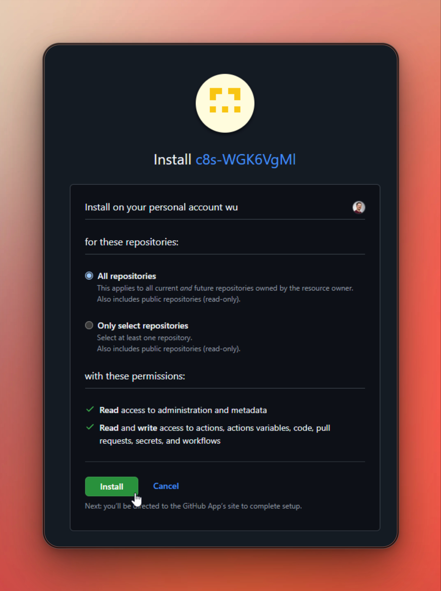
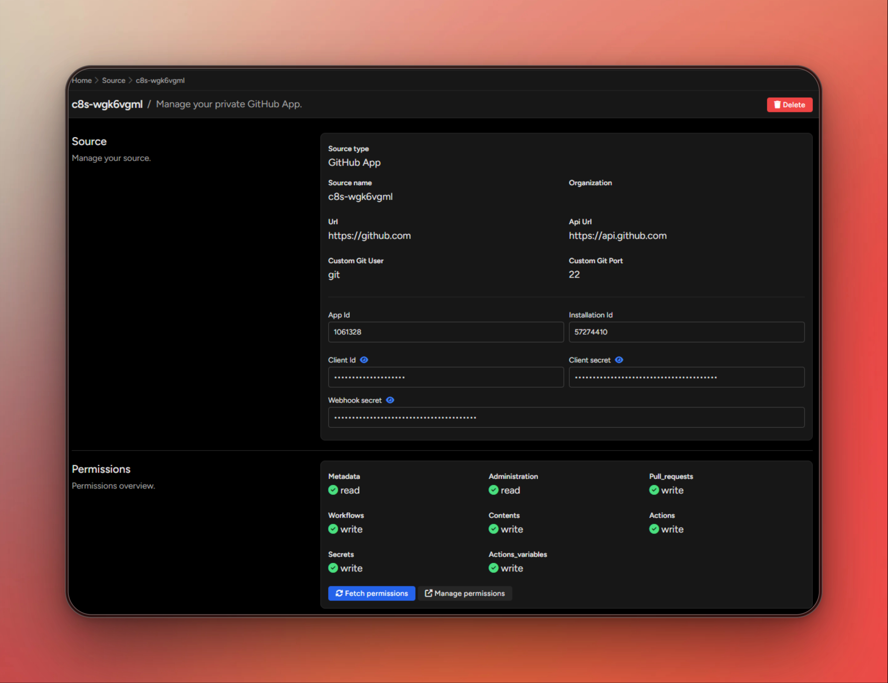

# GitHub sources

Providers are platform where your project are stored and where the CI/CD pipelines are runned.

## Create a new GitHub provider

First, you will need to create a new provider in c8s.

- Go to the <ui-path>Sources</ui-path> menu. Then click on <control>+ Add</control>.
- Fill in a Name and an Organization.
  > <tip>These values will be used to create a new <emphasis>GitHub Application</emphasis>.</tip>
- Click on <control>Continue</control>

## Register a GitHub provider

This will leave you with an un-configured source in c8s. The next step will be to registered it within your
GitHub account

- Open the source under <ui-path>Sources | c8s-xxxxxxxx</ui-path>

- Click on <control>Register now</control>

- Click on <control>Create GitHub App for xxx</control>.

> <tip>This will create a new app on GitHub and redirect you back to c8s.</tip>

## Install a GitHub provider

- Head back to your source under <ui-path>Sources | c8s-xxxxxxxx</ui-path> and click on <control>Install GitHub App</control>.

- Install this app on your personal GitHub account and grant access to one or many of you <emphasis>repositories</emphasis>. Click on <control>Install</control>.

## Verify configuration

You can see your source under <ui-path>Permissions | c8s-xxxxxxxx</ui-path> in the <ui-path>Permissions</ui-path> section.

To refresh permissions you can click on <control>Fetch permissions</control> button.

